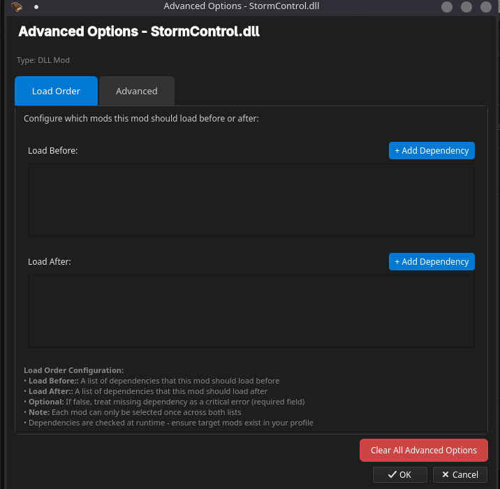
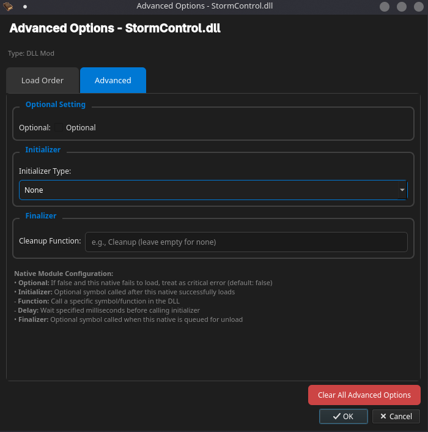
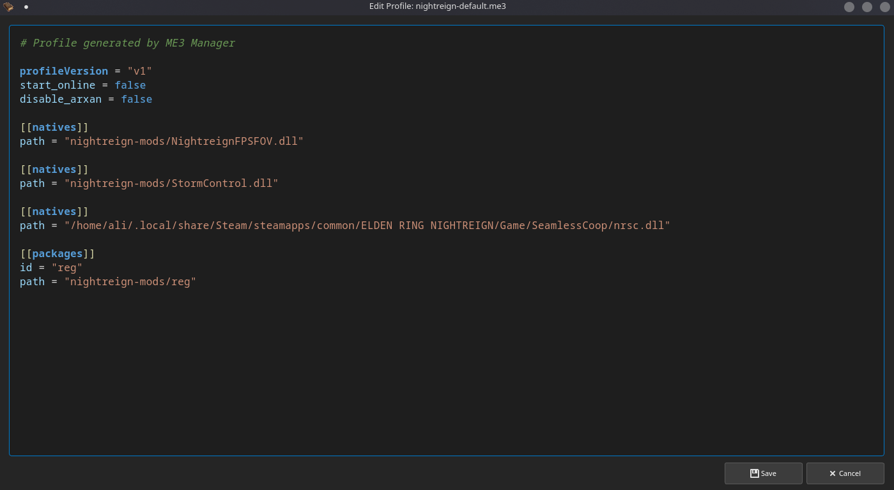
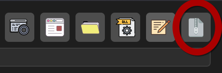

# Managing Mods

Understand mod states, actions, and best practices.

## Mod list basics

- Name
- Enabled/disabled state
- Actions (toggle, settings, advanced, delete)

## Enable or disable

- Click the toggle to switch state

## Advanced options

- Set load order and dependencies
- Configure DLL mod settings when available

## Removing a mod

- Click Delete → confirm

## External mods (keep mod outside the folder)

You can add a `.dll` from any location without moving it into the mods folder — useful for cases like Seamless Co-op that you prefer to keep alongside the game files.

## Edit/view .me3 file (advanced)

You can open and view the active `.me3` profile file. Editing is not recommended unless you know what you’re doing.

## Export mods setup

Create a zip containing the `mods` folder and profile so you can share the complete setup.

Keep in mind that external mods won’t be part of the export. To ensure your mods setup is fully included, make sure all mods are placed within the mods folder before exporting.
