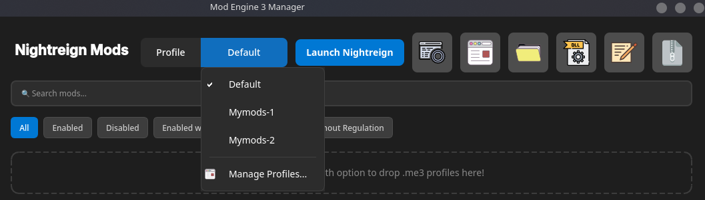
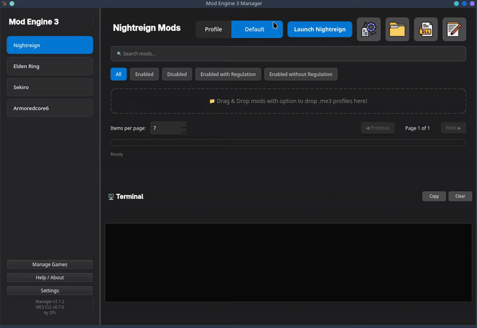
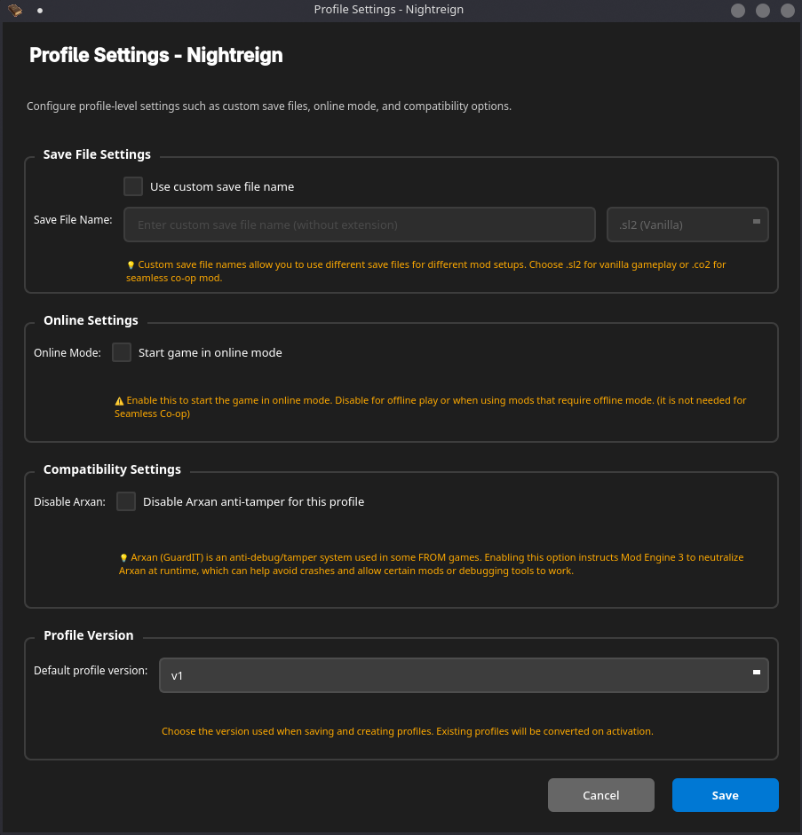

# Profiles

Profiles let you save different mod combinations and switch between them.

## Examples

- Vanilla+: few QoL mods
- Heavy Mods: gameplay overhaul
- Testing: temporary setups

## Create a profile

1. Open Manage Profiles
2. Click Add Profile
3. Name it → Save

## Switch profiles

- Use the profile dropdown to change the active profile
- Each profile remembers which mods are enabled

## Profile options

